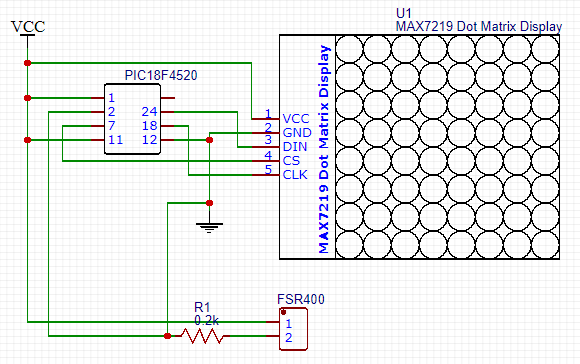

# Microprocessor Principles and Applications Project 2019 - Bicycle Brake Light

Use the pressure sensor (FSR400) to control the rear LED Dot Matrix Display to display the brake pattern.

The pressure sensor converts the analog signal into a digital signal by using an ADC, and divides the sensed value into two segments to display a different brightness of the brake light. 

Use timer2 and interrupt to make a flashing light, flash for 1 second and stop for 0.5 seconds.

## System Development
Environment：MPLAB IDE v5(XC8 compiler)

Language：C

## Hardware
Dot Matrix

MAX7219

Capacitance

Resistance

FSR-400

## Technology
### SPI
In the MAX7219, when CS is set to low, it means that data can be transferred, the position and data are written into the SSPBUF, and the MAX7219 is transmitted through the SDO. After the data is transmitted, the CS is changed back to high.

### ADC
Set ADCON1, and set AN0 to analog. 
The resistance value will change when pressing the pressure sensor, and the voltage of the incoming AN0 will also change. Use the voltage change to judge the pressure.

### Interrupt
The part of the flashing is to use the interrupt to calculate. When the number of times that match the number of times we want, the flag will be set up, and after leaving the interrupt, the loop will judge whether the flag is set up. when the flag is set up, it runs into the function of showing light.

### Timer
The flashing is to calculate the time through timer2. Set PR2, and when TMR2 is added up to the same as PR2, it will run into the interrupt.

## API

### adc
```void ADC_Initialize(void);```

Initially set the ADC's input pin, analog to digits, and clear Register.

```int ADC_Read(void);```

Read the value of the ADC input and return it.

### timer
```void init_interrupt(void);```

Initially set the interrupt, turn timer2 on, and set PR2 to trigger every 0.25 seconds.

### max7219
```void init_MAX7219(void);```

Initially set the MAX7219.

```void MAX7219_1Unit(unsigned char , unsigned char);```

Pass the address and data into WriteSPI (unsigned char).

### SPI
```signed char WriteSPI(unsigned char);```

Pass the value of SSPBUF into the slave.

### DrawLight
```void Draw(unsigned short *, int);```

The dot matrix lights up from the first line to the eighth line in sequence.

```void Stop(int)```

Set the brightness of the dot matrix.

```void TurnOff()```

Turn off the dot matrix

### newmain

Receive the voltage value, judge the size and choose different modes of lighting

## Circuit diagram


MAX7219 & Dot matrix 


## Actual brake light
